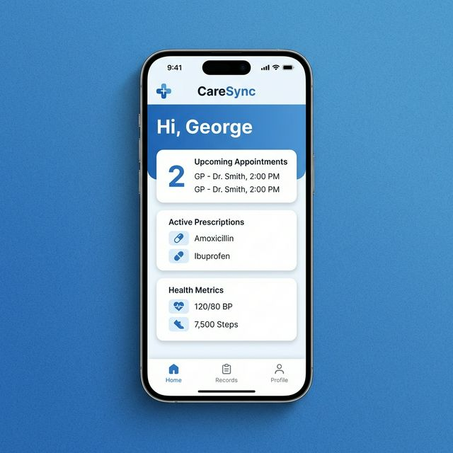
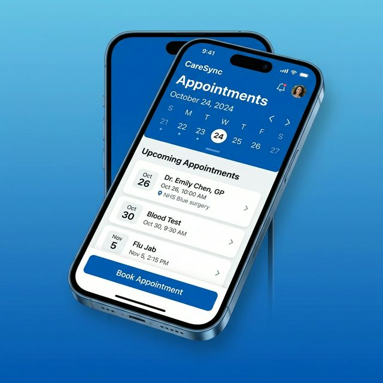
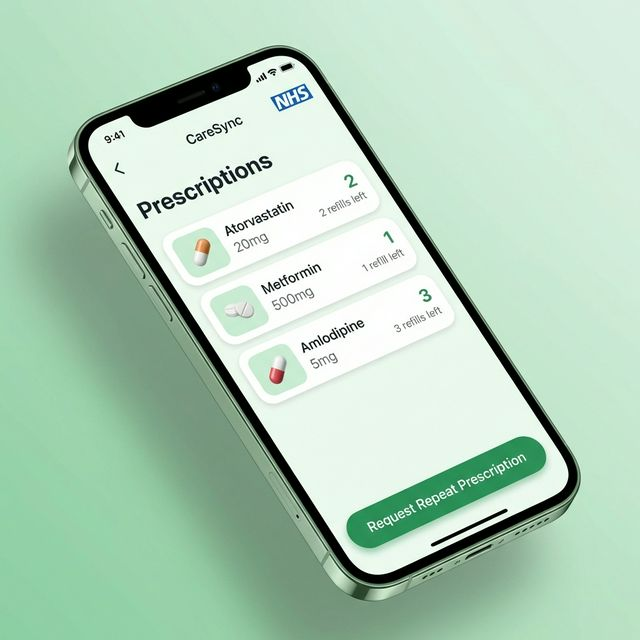

# CareSync

A modern, comprehensive, NHS-inspired personal health and appointment tracker mobile application built with Flutter. CareSync is designed to provide individuals with an accessible, robust tool to manage their health data completely offline, respecting patient privacy by storing all data securely on the device.

## Features

- **Personalized Dashboard:** A comprehensive view of upcoming appointments, active prescriptions, and recent health metrics.
- **Appointments Management:** Seamlessly book, track, update, and cancel GP appointments.
- **Repeat Prescriptions:** Monitor active medications and track refills with clear visual indicators.
- **Health Metrics Tracking:** Log and visualize critical health data like Blood Pressure, Heart Rate, Weight, and Blood Sugar over time.
- **Biometric Security:** Enhanced privacy with Fingerprint and FaceID authentication support.
- **Health Data Export:** Export health records in professional CSV, PDF, and JSON formats for clinical review.
- **AI Health Assistant:** Integrated Google Gemini AI for personalized health insights and trend analysis.
- **User Profile:** Manage personal details and NHS number in a unified setting.
- **Intelligent Notifications:** Stay on top of appointments and medication schedules with local push notifications.

## Architecture & Tech Stack

CareSync employs a robust **Clean Architecture** combined with **Flutter BLoC** for state management, ensuring a highly testable, scalable, and maintainable codebase.

- **Framework:** Flutter (SDK >=3.1.0)
- **State Management:** `flutter_bloc`
- **Dependency Injection:** `get_it`, `injectable`
- **Local Database:** `isar`, `isar_flutter_libs`
- **Navigation:** `go_router`
- **Assets & UI:** Custom NHS blue color palette, `flutter_screenutil` for responsiveness, `google_fonts` for typography.

## Previews

<div style="display: flex; flex-direction: row; gap: 10px;">
  
  
  
</div>

> Note: High-fidelity screenshots for store deployment are available in the `storeFile` directory at the root of this project.

## How to Reproduce & Run Locally

1. **Clone the repository:**
   ```bash
   git clone https://github.com/gikwegbu/caresync.git
   cd NHS_caresync
   ```

2. **Install Dependencies:**
   Ensure you have Flutter installed. Then run:
   ```bash
   flutter pub get
   ```

3. **Run Code Generation:**
   CareSync uses `freezed`, `json_serializable`, `injectable`, and `isar` generation tools.
   ```bash
   dart run build_runner build --delete-conflicting-outputs
   ```

4. **Run the App:**
   ```bash
   flutter run
   ```

## Testing

CareSync maintains full test coverage with unit and widget tests for core components.
```bash
flutter test
```

## License

This project is licensed under the MIT License - see the [LICENSE](LICENSE) file for details.

## Author

**George Ikwegbu**
- **Website:** [gikwegbu.netlify.app](https://gikwegbu.netlify.app/)
- **LinkedIn:** [linkedin.com/in/gikwegbu](https://www.linkedin.com/in/gikwegbu)
- **Twitter / X:** [@gikwegbu](https://twitter.com/gikwegbu)
- **GitHub:** [@gikwegbu](https://github.com/gikwegbu)
